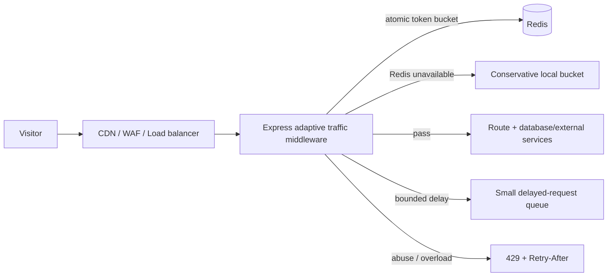
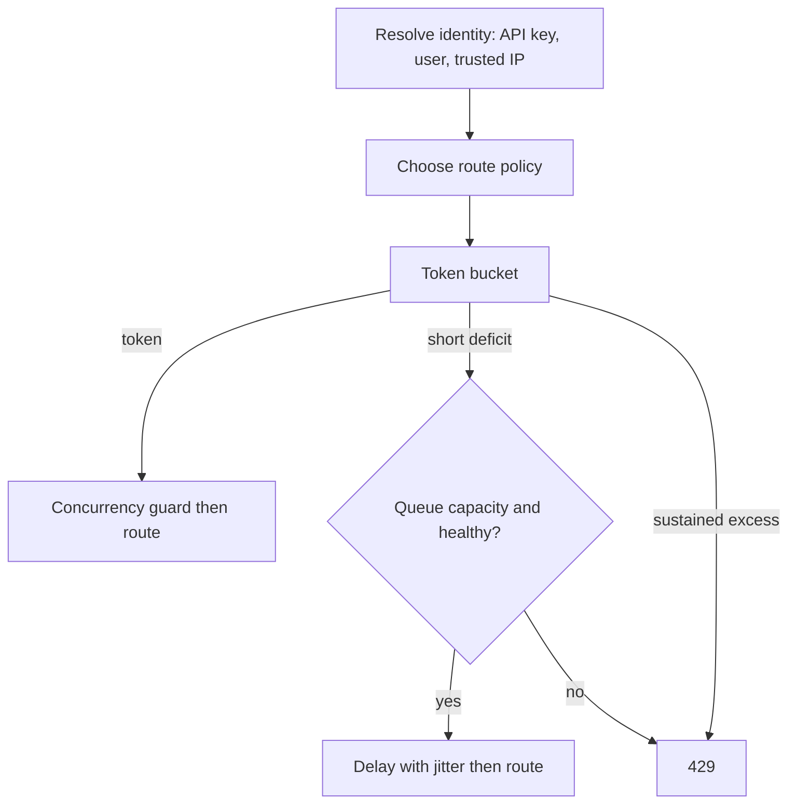

# DDoS protection runbook

## Application architecture

The application now uses token buckets with burst capacity, a strictly bounded short-delay tier, per-client route concurrency, strike-based recovery, and a final 429 rejection tier before JSON parsing or database work. With `RATE_LIMIT_REDIS_URL`, a Lua operation updates the token balance and strike count atomically across instances. If Redis is unavailable, the service deliberately falls back to a local limiter with half burst capacity: availability continues, but global enforcement is weaker until Redis recovers.

Identity is API-key hash, then authenticated-user hash, then client-IP hash. Forwarding headers are accepted only if the immediate socket peer is in `RATE_LIMIT_TRUSTED_PROXY_CIDRS`; otherwise they are ignored. Do not add public or broad ranges to this setting.

## Required production controls

1. Put the public hostname behind **Cloudflare proxying** (orange-cloud DNS), enable its managed DDoS protection and bot protection, and keep the Cloud Run URL out of public links.
2. Make Cloud Run ingress **internal-and-cloud-load-balancing** and expose it only through an external HTTPS load balancer. This prevents attackers from bypassing Cloudflare and hitting the `run.app` origin directly. Restrict the load balancer/origin path to the expected proxy where your network design permits it.
3. At Cloudflare, cache static assets and public GET responses where appropriate. Add WAF rate-limit rules for `/api/auth/*` and `/api/portal-auth/*` (for example, challenge above 10 requests per 15 minutes per IP) and a broader rule for `/api/*`. Exempt health probes only when their source is trusted.
4. Set a bounded Cloud Run maximum instance count that your Cloud SQL connection limits can sustain. Alert on 429 spikes, request count, latency, instance count, and Cloud SQL connection saturation.

## Application controls

The values in `.env.example` are development examples, not universal production limits. Tune by route and observed traffic. Public, normal API, high-security auth, and intensive upload/report endpoints each have independent sustained rate, burst, delay, and concurrency policies. The frontend retries only GET/HEAD 429s, at most twice, using `Retry-After` plus jitter; it never automatically repeats writes.

The service returns `429 Too Many Requests`, `Retry-After`, and standard `RateLimit-*` headers when a limit is exceeded. Health endpoints are excluded so Cloud Run does not restart healthy instances during a traffic event.

## Incident response

1. Turn on Cloudflare Under Attack mode or a managed challenge for the affected path.
2. Tighten the edge WAF rule temporarily; do not rely on an application redeploy during an active volumetric attack.
3. Inspect Cloudflare and Cloud Run logs for the targeted paths, countries/ASNs, response status, and origin-bypass attempts.
4. If the database is under pressure, enable the portal maintenance setting while keeping trusted administrators and health checks available.
5. After the event, remove temporary broad blocks, retain precise rules, and adjust the application limits only with observed traffic data.
