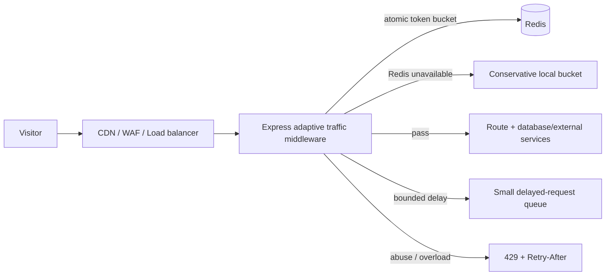
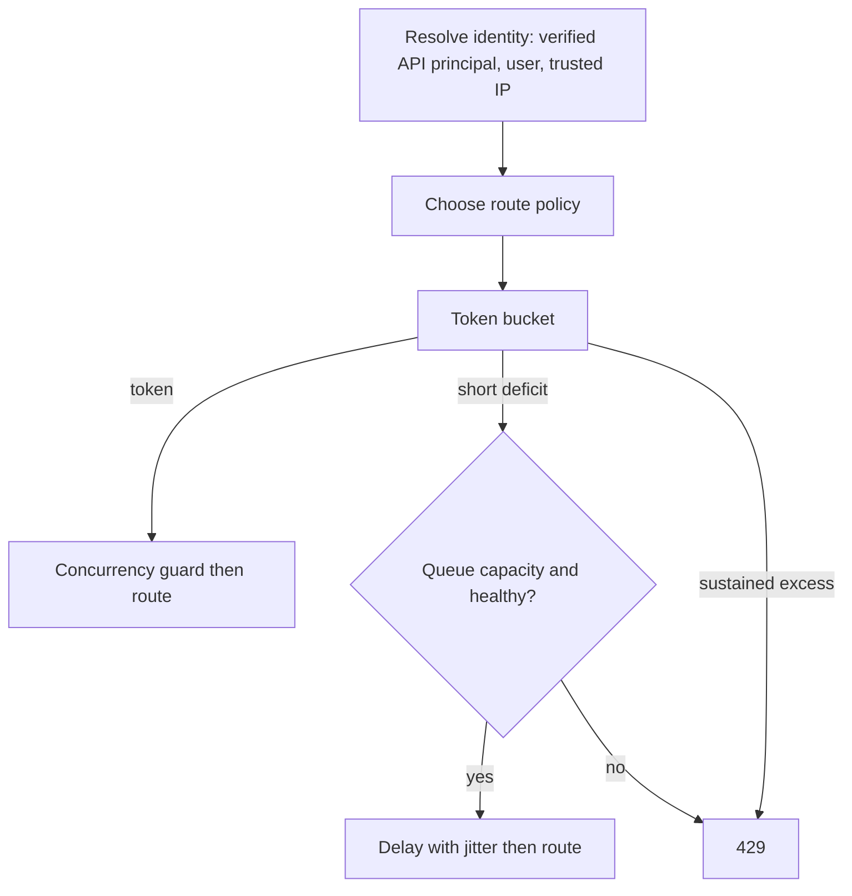

# DDoS protection runbook

## Application architecture

```mermaid
flowchart LR
  V[Visitor] --> E[CDN / WAF / Load balancer]
  E --> A[Express adaptive traffic middleware]
  A -->|atomic token bucket| R[(Redis)]
  A -->|Redis unavailable| L[Conservative local bucket]
  A -->|pass| P[Route + database/external services]
  A -->|bounded delay| Q[Small delayed-request queue]
  A -->|abuse / overload| X[429 + Retry-After]
```

```mermaid
flowchart TD
  I[Resolve identity: verified API principal, user, trusted IP] --> C[Choose route policy]
  C --> T[Token bucket]
  T -->|token| N[Concurrency guard then route]
  T -->|short deficit| Q{Queue capacity and healthy?}
  Q -->|yes| D[Delay with jitter then route]
  Q -->|no| R[429]
  T -->|sustained excess| R
```

The application uses token buckets with burst capacity, a strictly bounded short-delay tier, per-client route concurrency, strike-based recovery, and a final 429 rejection tier before JSON parsing or database work. With `REDIS_ENABLED=true` and `REDIS_URL`, one shared Redis client runs the Lua operation that updates token balance and strike count atomically across instances. If Redis is unavailable, the service deliberately falls back to a bounded local emergency limiter and logs `source: "local-fallback"`; it never becomes unlimited and automatically returns to Redis after reconnecting.

Identity is a server-validated service principal, authenticated-user hash, verified API-client principal, then client-IP hash. A raw caller-supplied header never creates an internal identity. Optional backend services use INTERNAL_SERVICE_ID, INTERNAL_SERVICE_SECRET, and a short-lived HMAC signature over the timestamp, method, and request path; authentication and expensive endpoint policies still apply to those requests. Forwarding headers are accepted only if the immediate socket peer is in RATE_LIMIT_TRUSTED_PROXY_CIDRS. Local/direct requests use the socket address and ignore forwarded headers. Do not add public or broad ranges to the explicit CIDR setting.

Traffic is classified before the limiter consumes a bucket: anonymous public reads use route-grouped public buckets, signed-in residents use the generous authenticated policy, CMS staff use admin_staff, login and verification flows use strict auth/OTP policies, and expensive public operations retain endpoint-specific protection. Public groups such as officials, barangays, news, events, and weather do not share one tiny /api/* bucket. Verified service calls bypass only normal request limiting and remain subject to route authorization.

Authenticated `GET /api/media` requests use the dedicated `media_read` policy (`RATE_LIMIT_MEDIA_READ_PER_MINUTE`, `RATE_LIMIT_MEDIA_READ_BURST`, and `RATE_LIMIT_MEDIA_READ_MAX_DELAY_MS`). Upload and deletion routes remain on the stricter upload/write policy; the read policy does not disable or bypass Redis protection.

## Required production controls

1. Put the public hostname behind **Cloudflare proxying** (orange-cloud DNS), enable its managed DDoS protection and bot protection, and keep the application origin out of public links.
2. Restrict the application origin to the approved reverse proxy or load balancer. This prevents attackers from bypassing Cloudflare and reaching the origin directly.
3. At Cloudflare, cache static assets and public GET responses where appropriate. Add WAF rate-limit rules for `/api/auth/*` and `/api/portal-auth/*` (for example, challenge above 10 requests per 15 minutes per IP) and a broader rule for `/api/*`. Exempt health probes only when their source is trusted.
4. Set a bounded application instance count that your database connection limits can sustain. Alert on 429 spikes, request count, latency, instance count, and database connection saturation.

## Application controls

The values in .env.example are development examples, not universal production limits. Tune by route and observed traffic. Public, authenticated, admin/staff, expensive, authentication, OTP, contact, upload, and admin-sensitive endpoints each have independent rate, burst, delay, and concurrency policies. Public officials, barangays, news, event, category, and notification reads use Redis-backed stale-while-revalidate caches with invalidation after CMS writes. The browser shares in-flight public requests and retries only read-only 429 responses with a capped, jittered backoff that honors Retry-After; writes are never automatically replayed.

The service returns `429 Too Many Requests`, `Retry-After`, and standard `RateLimit-*` headers when a limit is exceeded. Health endpoints are excluded so the hosting platform does not restart healthy instances during a traffic event.

## Incident response

1. Turn on Cloudflare Under Attack mode or a managed challenge for the affected path.
2. Tighten the edge WAF rule temporarily; do not rely on an application redeploy during an active volumetric attack.
3. Inspect the reverse proxy and application logs for the targeted paths, countries/ASNs, response status, and origin-bypass attempts.
4. If the database is under pressure, enable the portal maintenance setting while keeping trusted administrators and health checks available.
5. After the event, remove temporary broad blocks, retain precise rules, and adjust the application limits only with observed traffic data.
